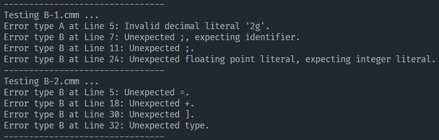

# compiler-lab-hit

哈尔滨工业大学 2025春 编译原理 课程实验

2022113573 2203101

纯天然无参考原创 `C++` 实现

提供 Makefile，在子模块中直接 `make` 即可

lab1 至 lab2 提供自动化测试脚本，于对应子模块中运行测试脚本即可批量测试

| 子模块 | 介绍                                                   |
| ------ | ------------------------------------------------------ |
| lab1   | 对应实验一，最初版，`C`实现                            |
| lab1.5 | 更改`Flex`和`Bison`接口为`C++`，并重构 lab1，`C++`实现 |
| lab2   | 对于实验二，`C++`实现                                  |
| lab3   | 截止日期后上传                                         |

## 结果展示

### lab1 词法分析与语法分析

- 单错误用例

- 多错误用例

### lab1.5 词法分析与语法分析

- 单错误用例
  

- 多错误用例
  

### lab2 语义分析

- 单错误用例

- 多错误用例

### lab3 中间代码生成

- 样例1

- 样例2

